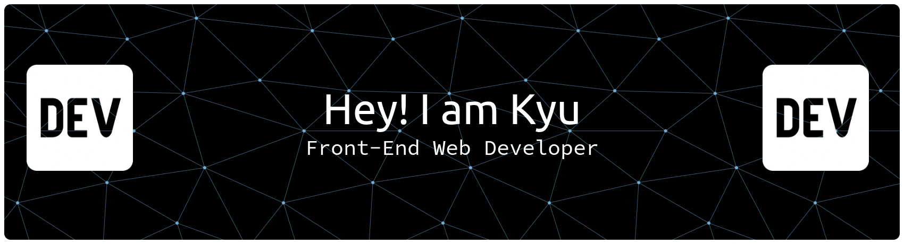

#### ⚡ Programming Skill
         

#### 🔭 Who Am I
- Working on projects for freelance clients.
- Loves cool challenges.

#### 🌱 I'm learning
 

#### 🤔 My Github Stats

#### 📫 Connect with me

<!--
**MS-KyuZ0/MS-KyuZ0** is a ✨ _special_ ✨ repository because its `README.md` (this file) appears on your GitHub profile.

Here are some ideas to get you started:

- 🔭 I’m currently working on ...
- 🌱 I’m currently learning ...
- 👯 I’m looking to collaborate on ...
- 🤔 I’m looking for help with ...
- 💬 Ask me about ...
- 📫 How to reach me: ...
- 😄 Pronouns: ...
- ⚡ Fun fact: ...
  -->
